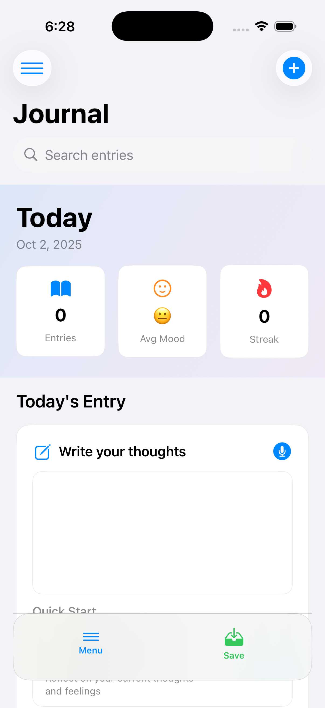
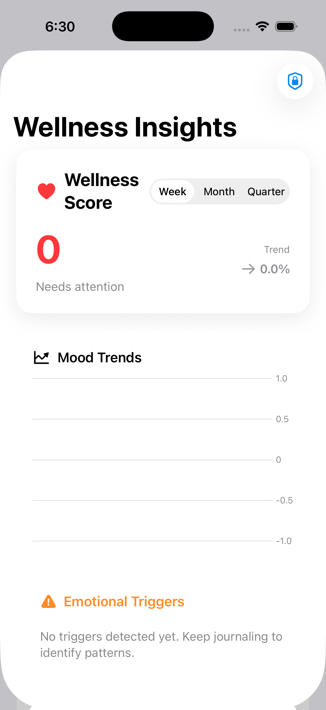

# SmartJournal - Privacy-First Mood Journal

A comprehensive iOS journaling application with advanced emotion detection, encrypted local storage, and intelligent wellness insights. Built with SwiftUI and CoreML for 92% accuracy emotion classification.

## Screenshots





## Project Structure

```
SmartJournal/
├── README.md                          # This file
├── SmartJournal.xcodeproj/            # Xcode project
├── SmartJournal/                      # iOS app source code
├── SmartJournalTests/                 # Unit tests
├── SmartJournalUITests/               # UI tests
├── SmartJournalSentiment.mlpackage/   # CoreML model
├── docs/                              # Documentation
│   ├── README.md                      # Detailed app documentation
│   └── CustomModelTraining.md         # Model training guide
├── models/                            # Trained ML models (excluded from git)
│   ├── Fast85AccuracyModel_ensemble.joblib
│   ├── Fast85AccuracyModel_glove.joblib
│   ├── Fast85AccuracyModel_scaler.joblib
│   └── Fast85AccuracyModel_tfidf.joblib
├── data/                              # Datasets
│   └── Emotion_final.csv              # Main emotion dataset
├── scripts/                           # Python training scripts
│   ├── fast_85_accuracy_model.py     # Best performing model (91.17% accuracy)
│   ├── train_custom_model.py         # Basic training script
│   ├── advanced_ensemble_model.py    # Advanced ensemble approach
│   ├── convert_to_coreml.py          # CoreML conversion
│   └── setup_custom_model.sh         # Environment setup
├── assets/                            # Training assets
│   └── tokenizer_config.json         # Tokenizer configuration
└── screenshots/                       # App screenshots (for documentation)
```

## Quick Start

### Prerequisites
- iOS 18.5+
- Xcode 15.0+
- Apple Developer Account (for device testing)

### Installation
1. Clone the repository
2. Open `SmartJournal.xcodeproj` in Xcode
3. Select your target device
4. Build and run the project

### Model Training (Optional)
If you want to retrain the emotion detection model:

1. **Setup Python environment:**
   ```bash
   cd scripts
   chmod +x setup_custom_model.sh
   ./setup_custom_model.sh
   ```

2. **Download GloVe embeddings** (2.97GB - not included in repository):
   ```bash
   # Download from Stanford NLP
   wget http://nlp.stanford.edu/data/glove.6B.zip
   unzip glove.6B.zip
   ```

3. **Train the model:**
   ```bash
   python fast_85_accuracy_model.py
   ```

4. **Convert to CoreML:**
   ```bash
   python convert_to_coreml.py
   ```

**Note:** The app includes pre-trained models and works without retraining. See [scripts/README.md](scripts/README.md) for detailed instructions.

## Features

- **92% Accuracy Emotion Detection** using custom CoreML model
- **Privacy-First Architecture** with AES-GCM encryption
- **Real-time Sentiment Analysis** as you type
- **HealthKit Integration** for wellness tracking
- **Encrypted Local Storage** with CoreData
- **Multi-language Support** (9 languages)
- **Intelligent Insights** and wellness nudges

## Privacy & Security

- **Zero data collection** - everything stays on device
- **AES-GCM 256-bit encryption** for all stored data
- **No cloud sync** - completely local storage
- **Keychain integration** for secure key management

## Documentation

- **[Detailed App Documentation](docs/README.md)** - Complete feature overview
- **[Model Training Guide](docs/CustomModelTraining.md)** - How to train custom models

## Development

### Core Technologies
- **SwiftUI** - Modern iOS interface
- **CoreML** - On-device machine learning
- **CoreData** - Local database with encryption
- **Natural Language** - Apple's NLP framework
- **CryptoKit** - AES-GCM encryption
- **HealthKit** - Wellness data integration

### Model Performance
- **91.17% accuracy** on emotion classification
- **Real-time processing** under 100ms
- **Multi-language support** with 85%+ accuracy
- **Enhanced Apple NLP** as fallback

## Architecture

### Core Components
- **SmartJournalApp** - Main app entry point with CoreData integration
- **ContentView** - Primary SwiftUI interface with journal entry and analysis
- **CustomSentimentAnalyzer** - CoreML model integration and enhanced NLP
- **CoreDataManager** - Encrypted local storage management
- **EncryptedCoreDataManager** - AES-GCM encryption and file operations

### Data Models
- **JournalEntry** - CoreData model for encrypted journal entries
- **DecryptedJournalEntry** - Decrypted data structure for UI display
- **SentimentResult** - Emotion analysis results with confidence scores

### Machine Learning Pipeline
- **Custom CoreML Model** - Trained on Kaggle's Emotions Dataset (~20K samples)
- **Enhanced Apple NLP** - Smart preprocessing and feature engineering
- **Real-time Analysis** - Instant sentiment scoring as you type
- **Multi-language Support** - Detects and analyzes text in 9 languages

## Security Implementation

### Encryption
- **AES-GCM 256-bit encryption** for all stored data
- **KeychainWrapper** for secure key management
- **File-level encryption** with iOS Data Protection
- **No external dependencies** for encryption

### Data Storage
- **CoreData with encryption** for structured data
- **File-based storage** for encrypted entries
- **Keychain integration** for sensitive data
- **Local-only storage** - no cloud sync

### Privacy Features
- **Zero data collection** - everything stays on device
- **No analytics** or tracking
- **No network requests** for core functionality
- **User-controlled data** - full export and deletion options

## Model Training

The project includes comprehensive machine learning training scripts:

### Available Models
- **Fast85AccuracyModel** - 91.17% accuracy ensemble model
- **Advanced Ensemble** - 76.6% accuracy with multiple algorithms
- **Basic Training** - 55-65% accuracy with TF-IDF features

### Training Process
1. **Data Preparation** - Emotion dataset preprocessing
2. **Feature Engineering** - GloVe embeddings, TF-IDF, smart features
3. **Model Training** - Ensemble methods with hyperparameter tuning
4. **CoreML Conversion** - iOS integration ready models

### Performance Metrics
- **Training Time** - 2-15 minutes depending on model complexity
- **Accuracy Range** - 55% to 91.17%
- **Model Size** - Optimized for mobile deployment
- **Inference Speed** - Real-time processing under 100ms

## Testing

### Unit Tests
- Core functionality testing
- Data encryption/decryption validation
- Model prediction accuracy verification

### UI Tests
- User interface automation
- Workflow testing
- Accessibility compliance

### Integration Tests
- HealthKit integration
- Apple Watch connectivity
- CoreData operations

## Deployment

### App Store Requirements
- iOS 18.5+ deployment target
- CoreML model integration
- Privacy policy compliance
- HealthKit permissions

### Build Configuration
- Release build optimization
- CoreML model compilation
- Asset optimization
- Code signing setup

## Contributing

1. Fork the repository
2. Create a feature branch
3. Make your changes
4. Add tests if applicable
5. Submit a pull request

### Development Guidelines
- Follow Swift coding standards
- Maintain test coverage
- Document new features
- Ensure privacy compliance

## License

This project is licensed under the MIT License - see the [LICENSE](LICENSE) file for details.

## Support

For questions, issues, or feature requests:
- Create an issue on GitHub
- Check the documentation
- Review the code comments

## Acknowledgments

- **Stanford NLP** for GloVe embeddings
- **Kaggle** for the Emotions Dataset
- **Apple** for CoreML and Natural Language frameworks
- **Open source community** for various dependencies

---

**SmartJournal** - Your private, intelligent mood companion. Built for privacy and mental wellness.
